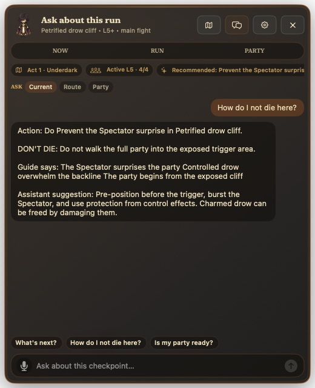
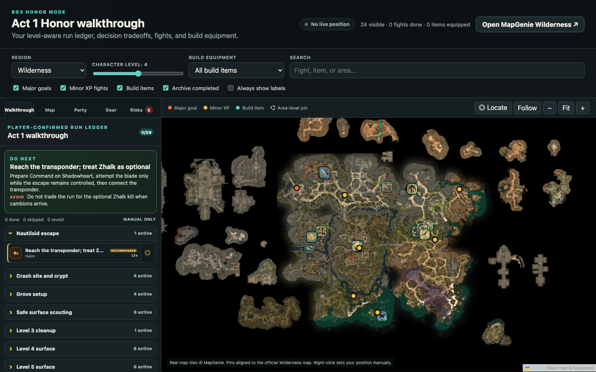

# BG3 Honor Mode Assistant

A quiet macOS overlay for keeping an Honor Mode run on track without leaving Baldur's Gate 3.

See the next safe action, check the risk before a fight, manage each companion's build, and mark progress yourself. The app stays in the menu bar and opens over BG3 only when you need it.

**This is not a BG3 mod.** It does not install game files, read memory or saves, automate input, record gameplay, or require Script Extender.

## What it does

- **Now** keeps the immediate action, preparation, failure condition, and Done/Skip controls in one place.
- **Run** provides a focused Act 1 route with decisions, missable warnings, and a resolved archive.
- **Party** shows one character at a time with current level, build plan, equipment, and item conflicts.
- **Map** opens a local Act 1 walkthrough and pickup map in your browser.
- **Chat** answers questions from the reviewed guide and your current run, with optional speech input and AI.

| Party and loadout | Guide-grounded chat |
| --- | --- |
|  |  |

## Install and play

Requirements: macOS 14 or later on Apple silicon.

1. Install [TestFlight from the Mac App Store](https://apps.apple.com/app/testflight/id899247664), accept the project's tester invite, and install **BG3 Honor Mode Assistant** from TestFlight.
2. Open **Settings** from the shield menu and keep or decline **Launch at Login**.
3. Start Baldur's Gate 3. Use the shield in the macOS menu bar to show the overlay manually when needed.
4. Move through **Now**, **Run**, and **Party**. Nothing is marked complete until you confirm it.
5. Use the map icon for the Act 1 map or the chat icon to ask about the current run.

The bundled local service starts with the app. A release build needs no terminal, Python installation, mod manager, or Script Extender.

## Keep separate Honor runs

Name and save multiple attempts, including solo and co-op campaigns. Each run keeps its own route progress, decisions, party, builds, and equipment. Switch the active run from the shield menu's **Run** submenu, or create and rename runs in the overlay's **Settings** view.

## AI chat and screenshots

Chat has two modes:

- **Guide-only:** works without an API key and returns deterministic answers from the reviewed route and current player-confirmed state.
- **OpenRouter AI:** add your own [OpenRouter](https://openrouter.ai/) key in the overlay's **Settings → AI Chat** section for short model-generated answers grounded in the same guide, current route, party, equipment, and recent conversation.

When OpenRouter AI is configured, opening chat prepares one current BG3-window screenshot for the next message. The attachment is visible in chat, opens as a preview, and can be removed before sending. It is sent to OpenRouter only with that message. The overlay is excluded because the app captures the BG3 window directly.

There is no periodic capture, background vision loop, video recording, or silent upload. Chat and speech input continue to work if you remove the screenshot or decline Screen Recording permission.

The OpenRouter key is stored in macOS Keychain. Run state stays in your Application Support directory, and the bundled service listens only on `127.0.0.1`.

## Act 1 map

The browser map shares the active run's manual progress and party equipment. It is the only separate app surface; normal planning and chat stay in the native in-game overlay.

## Current scope

The first public version covers the native macOS overlay, reviewed Act 1 route/build data, named Honor runs, party and equipment state, the local browser map, and optional OpenRouter chat. Act 2 and Act 3 guide coverage are not included yet.

Treat the guide as planning support, not a guarantee against game patches, player choices, or Honor Mode variance. This is an unofficial community project and is not affiliated with Larian Studios.

## Contributing

Technical contributions are welcome. Read [CONTRIBUTING.md](CONTRIBUTING.md) and the [architecture overview](docs/developers/ARCHITECTURE.md), keep pull requests focused, source guide-data corrections, and describe local verification. Internal tests and generated QA artifacts are intentionally excluded from public Git.

Good next milestones:

- Reviewed Act 2 and Act 3 routes, decisions, builds, and map data
- TestFlight feedback, release automation, and a public beta invite
- Accessibility, keyboard-navigation, and first-run onboarding passes
- Localization-ready guide and interface strings
- Stronger deterministic chat evaluation and screenshot-attachment coverage

Security reports should follow [SECURITY.md](SECURITY.md). Release maintainers can use [docs/developers/RELEASE.md](docs/developers/RELEASE.md).

## License

[MIT](LICENSE)
