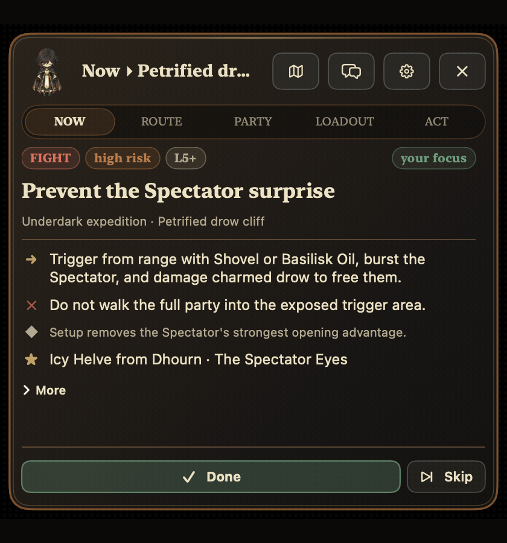
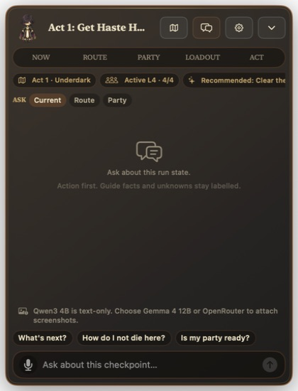
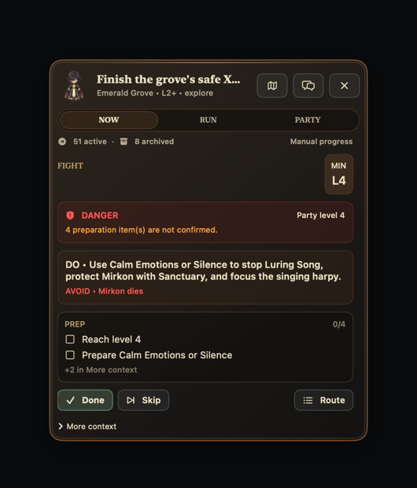
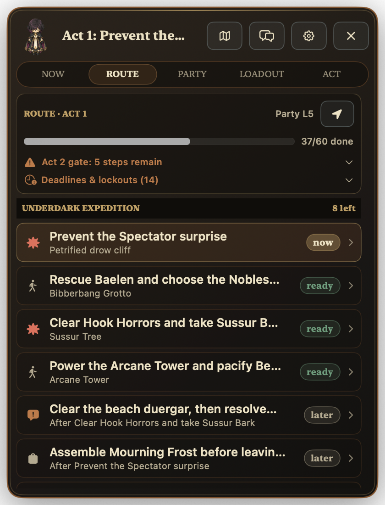
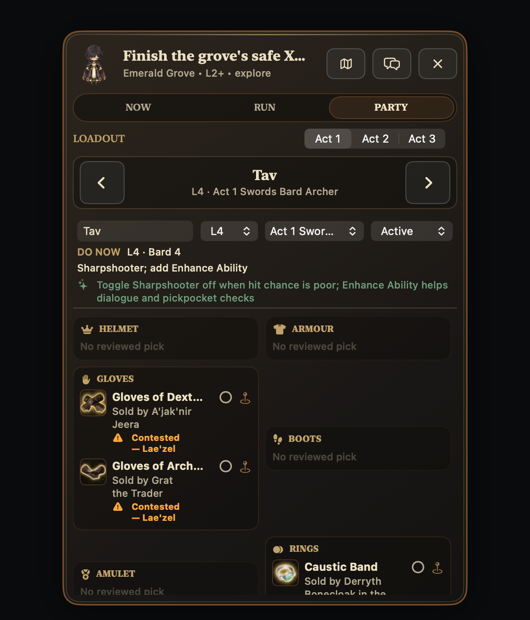
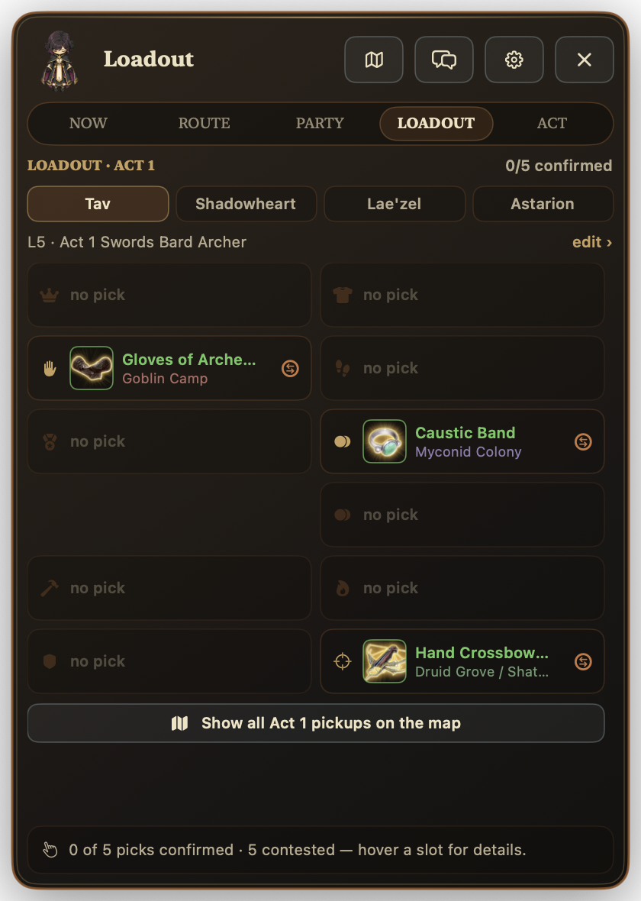

<p align="center">
  
</p>

<h1 align="center">BG3 Overlay</h1>

<p align="center"><strong>Keep any Baldur's Gate 3 run on track without tabbing out.</strong></p>

<p align="center">
  A native macOS overlay for your next objective, route, party builds, and gear.
</p>

<p align="center">
  <a href="#quick-start">
    
  </a>
  <br>
  <sub>macOS 14+ | Apple silicon | Beta | No mod or account required</sub>
</p>

<p align="center">
  <a href="https://youtu.be/CJtXg8_e2i8">
    
  </a>
</p>

I kept leaving Baldur's Gate 3 to check guides, a spreadsheet, build pages, and maps. BG3 Overlay keeps that information beside the game and adapts it to Explorer, Balanced, Tactician, Honour, or Custom difficulty. [Watch the original walkthrough on YouTube](https://youtu.be/CJtXg8_e2i8).

> **Current beta coverage:** Act 1 route guidance is available. Act 3 is available for runs started or caught up there. Act 2 includes equipment and a public map handoff, but its route is not ready, so normal progression from Act 2 to Act 3 remains locked.

## Quick start

The app works on Apple silicon Macs running macOS 14 or later. The first install takes about 5 to 10 minutes and needs an internet connection and about 3 GB of free space. A local model needs another 2.5 GB for Qwen or 7.6 GB for Gemma.

### Install without Git

1. [Download the project ZIP](https://github.com/data-maki/bg3-assistant/archive/refs/heads/main.zip), then double-click it to extract the `bg3-assistant-main` folder.
2. Open **Terminal** from Spotlight (`Command-Space`, then type `Terminal`).
3. Type `cd `, including the space, then drag the extracted folder into Terminal and press Return.
4. Paste the command below and press Return:

```sh
bash ./install-macos.sh
```

If macOS asks to install Command Line Tools, finish that installer and run the same command again. The assistant is then installed in `~/Applications` and opens automatically.

You do not need Git, Python, Homebrew, the full Xcode app, an Apple developer account, a mod manager, or Script Extender.

<details>
<summary><strong>Install with Git instead</strong></summary>

```sh
git clone https://github.com/data-maki/bg3-assistant.git
cd bg3-assistant
bash ./install-macos.sh
```

</details>

### Set up your first run

1. Choose whether this is a new run or one already in progress.
2. Choose your difficulty and whether to reveal the full act or only three tasks ahead.
3. Optionally choose an AI provider now, or continue and set it up later:

   | Option | Best for | Screenshot chat |
   | --- | --- | --- |
   | Local Gemma 4 12B | The full private experience. Uses about 7.6 GB. | Yes |
   | Local Qwen3 4B | A smaller, faster 2.5 GB download for text chat. | No |
   | OpenRouter | Cloud AI without a large local model. Requires your API key and credits. | Yes |

   

4. Pick your active party, levels, and reviewed or manual builds.
5. Click **Start Adventuring**, then launch Baldur's Gate 3.

### Pick an AI option based on memory

Check your available memory with BG3 already running:

1. Load your save so BG3 is using its normal amount of memory.
2. Open **Activity Monitor** and click **Memory**.
3. At the bottom, subtract **Memory Used** from **Physical Memory**.

```text
Available memory = Physical Memory - Memory Used
```

Use this quick guide:

| Available memory after loading BG3 | Pick | Screenshot chat |
| --- | --- | --- |
| Less than 8 GB, or Memory Pressure is yellow or red | OpenRouter | Yes |
| 8 to 15 GB | Local Qwen3 4B | No |
| 16 GB or more | Local Gemma 4 12B | Yes |

For example, if your Mac has 32 GB and Activity Monitor shows 19 GB used, you have about 13 GB available. Pick Qwen for local text chat or OpenRouter if you want screenshots. Because you check after loading your save, the calculation already includes BG3, macOS, Steam, Discord, and anything else you left open.

These are conservative estimates, not hard limits. If Memory Pressure turns yellow or the game starts stuttering, switch to OpenRouter. It runs the model in the cloud and uses much less memory on your Mac. [Apple explains Memory Pressure here](https://support.apple.com/guide/activity-monitor/actmntr34865/mac).

Follow **Now** for your next objective. Open **Route**, **Party**, or **Loadout** when you need more detail.

You can close Terminal after installation. To update the app later, open the project folder in Terminal and run `bash ./install-macos.sh` again.

Invited TestFlight testers can install through [TestFlight](https://apps.apple.com/app/testflight/id899247664) instead.

## Windows (experimental)

The Windows overlay is implemented, but there is no signed public release yet. It has only been installed and exercised in Windows 11 ARM64 through Parallels on Apple silicon at 200% display scaling. It has not been tested on Intel/AMD hardware or a native Windows PC. BG3 window detection used controlled test windows named `bg3.exe` and `bg3_dx11.exe`; the current evidence does not prove live-game behavior.

Use these settings when testing the overlay:

| Setting | Required value |
| --- | --- |
| Package | ARM64 for Windows ARM64 in Parallels. The x64 package still needs native Intel/AMD validation. |
| BG3 display mode | **Borderless Windowed** or **Windowed**. Exclusive full-screen is unsupported. |
| Privileges | Run BG3 and BG3 Honor Assistant as a normal user. Do not run BG3 as administrator. |
| Assistant | Turn on **Show overlay while BG3 is running**. **Start at login** is optional and off by default. |
| Hidden overlay | Open the system-tray menu and select **Show Overlay** or **Open Planner**. |
| AI | Optional OpenRouter text chat only. The Windows build has no local model, screenshot, microphone, or speech support. |

The current MSIX is a development package, not a player download. Do not distribute an unsigned or self-signed build. See the [Windows README](windows/README.md) for the exact status, contributor setup, installation behavior, and remaining hardware gates.

## What the app shows

| Next objective | Route and blockers |
| --- | --- |
|  |  |

| Party builds | Gear targets |
| --- | --- |
|  |  |

## Use it during a run

1. Check **Now** for the next objective, its risk, and what to avoid.
2. Mark the objective done, record another outcome, or skip it.
3. Open **Route** to change priorities or see what is blocked.
4. Use **Party** and **Loadout** when you level up or want to chase an item.
5. Review missed equipment and unresolved decisions before leaving an act.

The app only knows what you tell it. It does not read your save or mark anything complete on its own.

## Other features

- Keep separate solo, co-op, and retry runs.
- Manage active, camp, and unrecruited characters, including Withers hirelings.
- Open the walkthrough, pickup plan, or public map for the current act.
- Ask questions from the overlay by typing or speaking.
- Import a build from a public URL and assign it to a character.
- Build your own character from Level 1 to 12 with manual ability points, multiclass levels, subclasses, feats, class options, and the current bg3.wiki spell lists.

Imported builds are drafts. The app creates a valid 27-point starting allocation, but you should check the classes, spells, feats, equipment, and later levels against the original build.

## Current coverage

| Act | Route | Equipment | Map |
| --- | --- | --- | --- |
| Act 1 | Available | Available | Public map handoff |
| Act 2 | Not yet available | Available | Public Shadow-Cursed Lands handoff |
| Act 3 | Available for started/caught-up runs | Available | Public Baldur's Gate handoff |

The current route is opinionated: it favors a cautious, generally good-aligned run and preserving companion and rescue outcomes. Treat it as planning support, not a guarantee against patches, unusual choices, or difficulty-specific variance.

## Privacy and permissions

- This is not a BG3 mod. It does not change game files, read saves or memory, automate input, or record gameplay.
- Your runs, party, and imported builds stay in your Application Support folder.
- The guide and planner work without AI. Public maps need internet access.
- Local Gemma and Local Qwen run on your Mac after you download the model.
- OpenRouter receives the run details needed to answer your question. The API key stays in macOS Keychain.

Local Gemma and OpenRouter chat can attach one screenshot of the visible BG3 window if you grant Screen Recording permission. You can preview or remove it before sending. The app does not capture in the background. Gemma processes screenshots on your Mac; OpenRouter sends them to its cloud model. Local Qwen is text-only and does not accept screenshots.

Build import downloads text from the public URL. Local Gemma and Local Qwen process it on your Mac; OpenRouter receives the URL and extracted text. Speech input asks for microphone and Speech Recognition permission.

## Contribute

You can contribute route corrections, build data, Swift UI, or app behavior. Keep each change focused on one player problem. The app will remain an overlay, not a BG3 mod.

### Developer quickstart

You need macOS 14 or later and Swift 6. Clone the repo, run the full native validation, then build and open the app:

```sh
git clone https://github.com/data-maki/bg3-assistant.git
cd bg3-assistant
./scripts/macos/validate.sh
./scripts/macos/build-app.sh
open "artifacts/macos/app/BG3 Overlay.app"
```

| What you want to change | Start here |
| --- | --- |
| Overlay UI or native behavior | `mac/BG3Assistant/` |
| Swift tests | `mac/Tests/` |
| Routes, builds, items, or guide facts | `data/` |
| Guide generation or backend tooling | `backend/` |
| Build and release automation | `scripts/macos/` |

Python 3.11+ and [`uv`](https://docs.astral.sh/uv/) are only required when changing guide data, its loaders, or backend tooling:

```sh
cd backend
uv sync --extra dev
uv run python scripts/export-swift-resources.py
uv run pytest -q
```

Before opening a pull request:

1. Read [CONTRIBUTING.md](CONTRIBUTING.md) and keep the change focused.
2. Run `./scripts/macos/validate.sh`; run the backend tests too when changing `data/` or `backend/`.
3. Include a screenshot for visible UI changes.
4. Never commit `.env` files, API keys, player data, or generated QA artifacts. Use `.env.example` only as a template.

See the [architecture guide](docs/developers/ARCHITECTURE.md) for data flow and component ownership, and the [release guide](docs/developers/RELEASE.md) for packaging and signing.

## Project links

- [Contributing](CONTRIBUTING.md)
- [Product and design history](docs/developers/DESIGN_HISTORY.md)
- [Architecture](docs/developers/ARCHITECTURE.md)
- [Release guide](docs/developers/RELEASE.md)
- [Security policy](SECURITY.md)

This is an unofficial community project and is not affiliated with Larian Studios.

## License

[MIT](LICENSE)
