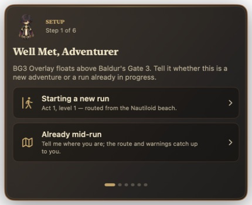
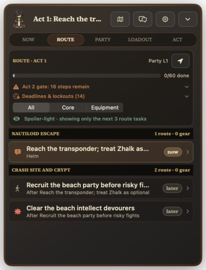
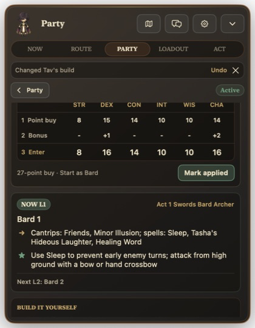
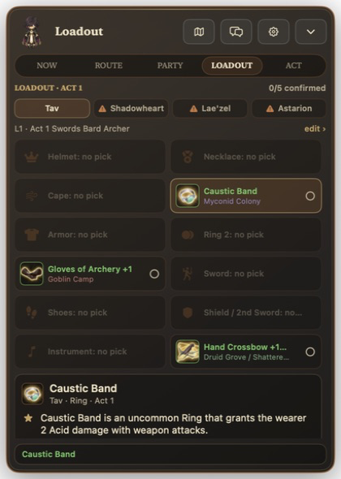
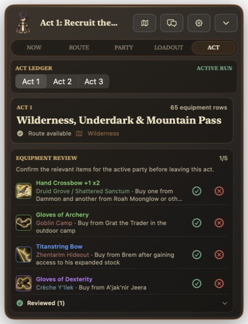
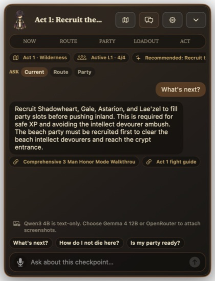

# BG3 Overlay macOS UI tear

This folder is a current-state visual inventory of the native macOS app and the
Windows replica reference.

- **47 clone 1-to-1 screenshots** are in
  [`screenshots/clone-1-to-1/`](screenshots/clone-1-to-1/).
- **12 Windows-adapted screenshots** are in
  [`screenshots/windows-adapted/`](screenshots/windows-adapted/).
- The exact differences for the adapted screens are defined in
  [`WINDOWS-PORT-GUIDE.md`](WINDOWS-PORT-GUIDE.md).
- Every captured state and action is indexed in [`SCREEN-INVENTORY.md`](SCREEN-INVENTORY.md).
- The SwiftUI owners, state/actions, runtime data, and image assets are mapped in [`SOURCE-ASSET-MAP.md`](SOURCE-ASSET-MAP.md).

## Capture basis

- App bundle: `artifacts/macos/app/BG3 Overlay.app`
- Editable source: `mac/BG3Assistant/`
- Build command: `./scripts/macos/build-app.sh`
- Capture date: 2026-07-25
- Git revision inspected: `591e233`
- State isolation: `artifacts/macos/ui-tear-state/`
- AI response proof: local Qwen3 4B only

The isolated state prevents the UI walkthrough from changing the user's saved runs. The existing OpenRouter key was never exposed, copied, replaced, or used. No cloud prompt was sent.

## Coverage

The screenshots cover:

1. Fresh-run onboarding, including difficulty, spoiler, AI-provider, party, and ready branches.
2. Mid-run onboarding, including Act 1, Act 2, Act 3, and landmark catch-up states.
3. Minimal, focus, and reference overlay states.
4. Now, Route, Party, Loadout, Act, Chat, and Settings.
5. Nested route details, manual builds, reviewed builds, build import, abilities, roster management, gear details, act previews, local-chat loading/response, and destructive confirmations.

Transient macOS `NSMenu` option lists do not consistently return a bitmap through the app-window screenshot API. Their visible before/after states are captured, and every menu option/action is still traced to its Swift source in [`SOURCE-ASSET-MAP.md`](SOURCE-ASSET-MAP.md).

## Representative captures

| Onboarding | Route |
| --- | --- |
|  |  |

| Party build | Loadout |
| --- | --- |
|  |  |

| Act ledger | Windows-adapted chat reference |
| --- | --- |
|  |  |

## Observed current-state notes

- Explorer deliberately disables onboarding continuation and offers **Close BG3 Overlay**.
- Act 2 exposes equipment and a map but reports its route as pending.
- Qwen is explicitly text-only; Gemma and OpenRouter are the screenshot-capable choices.
- Opening screenshot-capable chat without a BG3 window produces a visible capture error.
- A new blank manual build initially displayed `29/27 SPENT`; the reviewed Swords Bard recipe displayed `27/27 VALID`.
- Popup menus are source-traced, while action outcomes such as skipped, targeted, equipped, provider selected, and build assigned have their own PNGs.
